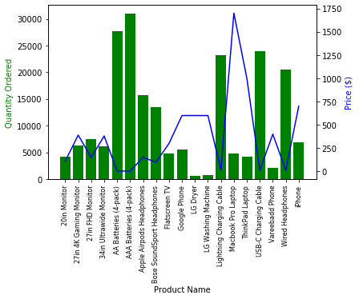

# Sales Analysis

This repository contains an analysis of sales data. The data includes information about the quantity of products ordered, their prices, and the total sales for each month and city.

## Monthly Sales

The first table shows the total quantity of products ordered, their total price, and the total sales for each month. The data is summarized in the following table:

| Month | Quantity Ordered | Price Each | Sales |
|-------|------------------|------------|-------|
| 1     | 10903            | 1.811768e+06 | 1.822257e+06 |
| 2     | 13449            | 2.188885e+06 | 2.202022e+06 |
| 3     | 17005            | 2.791208e+06 | 2.807100e+06 |
| 4     | 20558            | 3.367671e+06 | 3.390670e+06 |
| 5     | 18667            | 3.135125e+06 | 3.152607e+06 |
| ...   | ...              | ...          | ...         |

From this table, we can see that the highest sales were in December, with a total of $4,613,443.

## Sales by City

The second table shows the total quantity of products ordered, their total price, and the total sales for each city. The data is summarized in the following table:

| City               | Quantity Ordered | Price Each   | Sales       |
|--------------------|------------------|--------------|-------------|
| Atlanta (GA)       | 16602            | 2.779908e+06 | 2.795499e+06 |
| Austin (TX)        | 11153            | 1.809874e+06 | 1.819582e+06 |
| Boston (MA)        | 22528            | 3.637410e+06 | 3.661642e+06 |
| Dallas (TX)        | 16730            | 2.752628e+06 | 2.767975e+06 |
| Los Angeles (CA)   | 33289            | 5.421435e+06 | 5.452571e+06 |
| ...                | ...              | ...          | ...         |

From this table, we can see that the highest sales were in San Francisco (CA), with a total of $8,262,204.

## Data Cleaning

The raw data contained some rows with missing values, which were removed during the data cleaning process.

## Conclusion

This analysis provides insights into the sales performance of different products in different cities and months. Further analysis could be done to identify trends and patterns in the data to inform business decisions.
